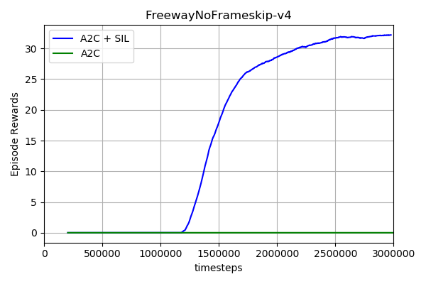

# Self-Imitation-Learning with A2C
   
This is the pytorch version of the **A2C + SIL** - **which is basiclly the same as the openai baselines**. The paper could be found [Here](https://arxiv.org/abs/1806.05635).
## TODO List
- [ ] Add PPO with SIL
- [ ] Add more results
## Requirements
- python-3.5.2
- openai-baselines
- pytorch-0.4.0
## Installation
Install OpenAI Baselines
```bash
# clone the openai baselines
git clone https://github.com/openai/baselines.git
cd baselines
pip install -e .

```
## How to use the code
Train the network:
```bash
python train --env-name 'PongNoFrameskip-v4' --cuda (if you have the GPU)

```
Test the network:
```bash
python demo.py --env-name 'PongNoFrameskip-v4'

```
You could also try the A2C algorithm without SIL by adding flag `--no-sil`:
```bash
python train --env-name 'PongNoFrameskip-v4' --cuda --no-sil

```
## Training Performance
Because of time, I just run Pong with 2 million steps. The results of **MontezumaRevenge** will be uploaded later!

Another results for the **Freeway** which is correspond with the original paper.  

## Acknowledgement
[@junhyukoh](https://github.com/junhyukoh) for [original code](https://github.com/junhyukoh/self-imitation-learning)


